# DT-SOPS Demo for Steelmaking Plants

<p align="center">
  <strong>Simulation-based digital twin demonstrations across 12 steelmaking plant configurations</strong>
</p>

<p align="center">
  
  
  
</p>

This repository presents visual demonstrations of **DT-SOPS**, a digital twin-enabled scheduling optimization system developed for steelmaking production. The gallery documents implementations across 12 plant configurations with different production boundaries, process routes, workloads, equipment structures, and continuous-casting arrangements.

DT-SOPS combines rapid model-based scheduling optimization with evaluation in a more detailed simulation-based digital twin. When a candidate schedule does not satisfy the prescribed executability criterion, evaluation feedback is used to calibrate the model and adjust the schedule before another simulation run.

## Demonstration video

<p align="center">
  <a href="assets/dt-sops-demonstration.mp4">
    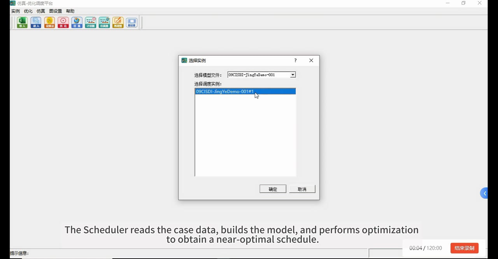
  </a>
</p>

<p align="center">
  <strong><a href="assets/dt-sops-demonstration.mp4">&#9654; Watch the full DT-SOPS demonstration video</a></strong>
</p>

> **Evidence scope.** The companion manuscript reports quantitative experiments for three plant cases. The additional configurations shown here provide qualitative evidence of engineering implementation and modular reuse; they are not presented as proof of direct generalization to an unseen plant.

## Plant portfolio

| Demo | Plant case | Process scope | Workload | Reported planning result | Calibration outline |
|---|---|---|---:|---|---|
| Model 0 | Zhejiang Yuanli Steelmaking Plant | BOF to continuous casting | 134 heats | CCT: 1410 | Sequence-based planning |
| Model 1 | Sichuan Desheng Steelmaking Plant | Hot-metal arrival to continuous casting | 126 heats | CCT: 1421 | Compact planning, route adaptation, casting-priority adjustment, and schedule repair |
| Model 2 | Rizhao ESP Steelmaking Plant | BOF to continuous casting | 257 heats | CCT: 1470 | Sequence-based planning |
| Model 3 | Jiangsu Yonggang Steelmaking Plant | Hot-metal arrival to continuous casting | 41 / 97 heats (72 h) | CCT: 1664 / 4365 | Sequence-based planning and casting-start repair |
| Model 4 | Jingye Steelmaking Plant | BOF to continuous casting | 64 / 85 heats | CCT: 2836 for the reported scenario | Sequence-based planning and casting-start repair |
| Model 5 | Dagang Steelmaking Plant | Hot-metal arrival to continuous casting | 84 heats | CCT: 1440 | Sequence-based planning |
| Model 6 | Hangang Steelmaking Plant | Hot-metal arrival to BOF | 135 heats | Production requirement satisfied | Sequence-based planning |
| Model 7 | Nangang Steelmaking Plant | One-ladle hot-metal process to continuous casting | 90 heats | CCT: 1469 | Hybrid compact/sequence planning and casting-start repair |
| Model 8 | Xindachang Plant | One-ladle hot-metal process to BOF | 74 heats | Production requirement satisfied | Compact planning |
| Model 9 | Yinggang Steelmaking Plant | BOF to continuous casting | 64 heats | CCT: 1410 | Sequence-based planning |
| Model 10 | Jingxi Steel Plant | Hot-metal arrival to continuous casting | 83 heats | CCT: 1609 | Compact planning |
| Model 11 | Shandong Steel Plant | BOF to continuous casting | 185 heats | CCT: 1832 | Compact planning, route adaptation, and schedule repair |

The structured version of this catalog is available in [`data/plant_catalog.csv`](data/plant_catalog.csv). Product-family identifiers in the demonstrations are anonymized.

## Plant implementation gallery

Each card pairs a plant-specific simulation-based DT view with its continuous-casting rhythm. Select an image to inspect it at full resolution.

<table>
  <tr>
    <td width="50%" valign="top">
      <h3>Model 0 - Zhejiang Yuanli</h3>
      <p><b>134 heats</b> · BOF to continuous casting</p>
      <a href="assets/simulation/model0.gif">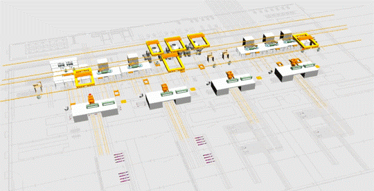</a>
      <a href="assets/casting-rhythm/model0.png">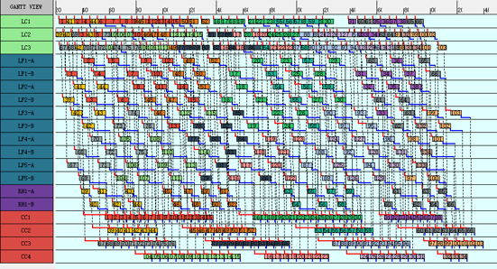</a>
    </td>
    <td width="50%" valign="top">
      <h3>Model 1 - Sichuan Desheng</h3>
      <p><b>126 heats</b> · Hot-metal arrival to continuous casting</p>
      <a href="assets/simulation/model1.gif">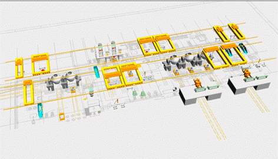</a>
      <a href="assets/casting-rhythm/model1.png">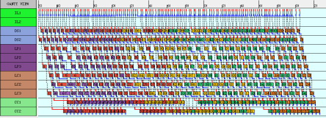</a>
    </td>
  </tr>
  <tr>
    <td width="50%" valign="top">
      <h3>Model 2 - Rizhao ESP</h3>
      <p><b>257 heats</b> · BOF to continuous casting</p>
      <a href="assets/simulation/model2.gif">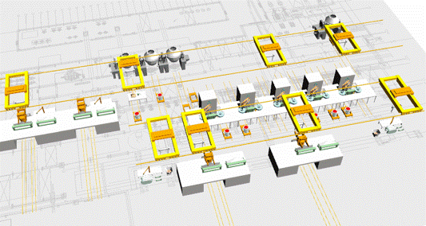</a>
      <a href="assets/casting-rhythm/model2.png">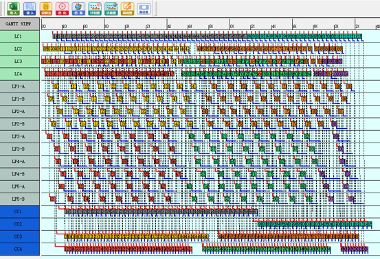</a>
    </td>
    <td width="50%" valign="top">
      <h3>Model 3 - Jiangsu Yonggang</h3>
      <p><b>41 / 97 heats</b> · Hot-metal arrival to continuous casting</p>
      <a href="assets/simulation/model3.gif">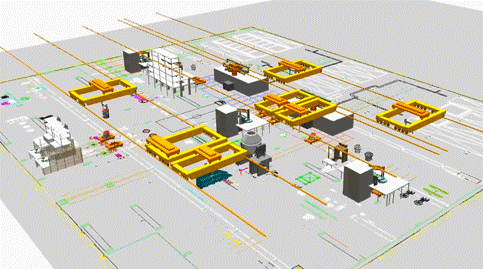</a>
      <a href="assets/casting-rhythm/model3.png">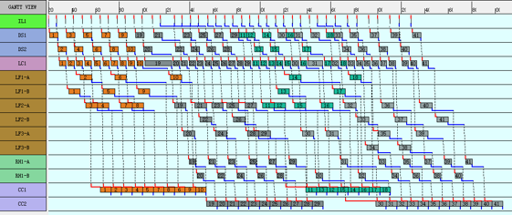</a>
    </td>
  </tr>
  <tr>
    <td width="50%" valign="top">
      <h3>Model 4 - Jingye</h3>
      <p><b>64 / 85 heats</b> · BOF to continuous casting</p>
      <a href="assets/simulation/model4.gif">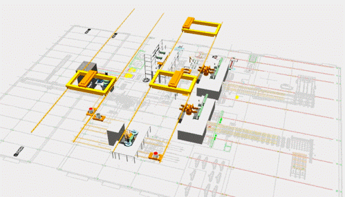</a>
      <a href="assets/casting-rhythm/model4.png">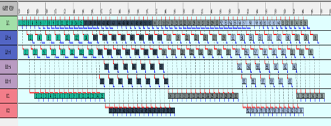</a>
    </td>
    <td width="50%" valign="top">
      <h3>Model 5 - Dagang</h3>
      <p><b>84 heats</b> · Hot-metal arrival to continuous casting</p>
      <a href="assets/simulation/model5.gif">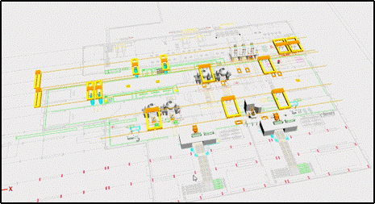</a>
      <a href="assets/casting-rhythm/model5.png">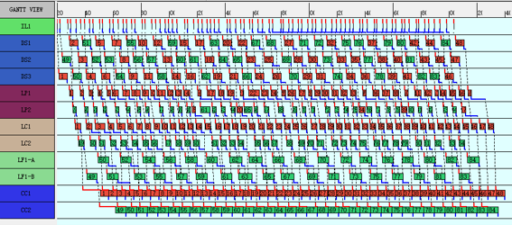</a>
    </td>
  </tr>
  <tr>
    <td width="50%" valign="top">
      <h3>Model 6 - Hangang</h3>
      <p><b>135 heats</b> · Hot-metal arrival to BOF</p>
      <a href="assets/simulation/model6.gif">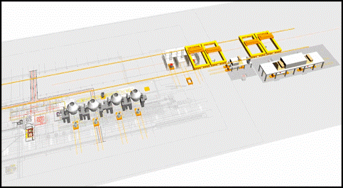</a>
      <a href="assets/casting-rhythm/model6.png">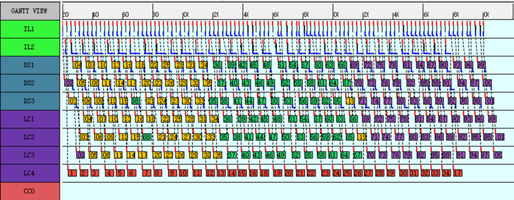</a>
    </td>
    <td width="50%" valign="top">
      <h3>Model 7 - Nangang</h3>
      <p><b>90 heats</b> · One-ladle hot-metal process to continuous casting</p>
      <a href="assets/simulation/model7.gif">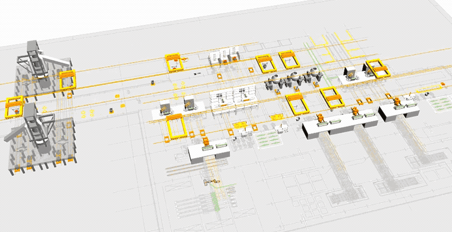</a>
      <a href="assets/casting-rhythm/model7.png">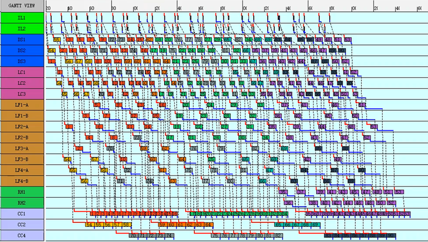</a>
    </td>
  </tr>
  <tr>
    <td width="50%" valign="top">
      <h3>Model 8 - Xindachang</h3>
      <p><b>74 heats</b> · One-ladle hot-metal process to BOF</p>
      <a href="assets/simulation/model8.gif">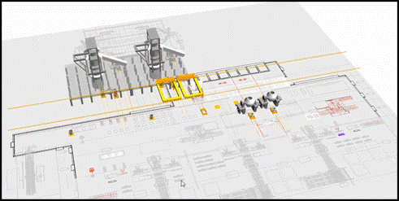</a>
      <a href="assets/casting-rhythm/model8.png">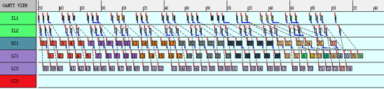</a>
    </td>
    <td width="50%" valign="top">
      <h3>Model 9 - Yinggang</h3>
      <p><b>64 heats</b> · BOF to continuous casting</p>
      <a href="assets/simulation/model9.gif">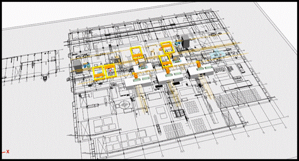</a>
      <a href="assets/casting-rhythm/model9.png">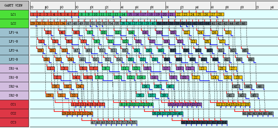</a>
    </td>
  </tr>
  <tr>
    <td width="50%" valign="top">
      <h3>Model 10 - Jingxi</h3>
      <p><b>83 heats</b> · Hot-metal arrival to continuous casting</p>
      <a href="assets/simulation/model10.gif">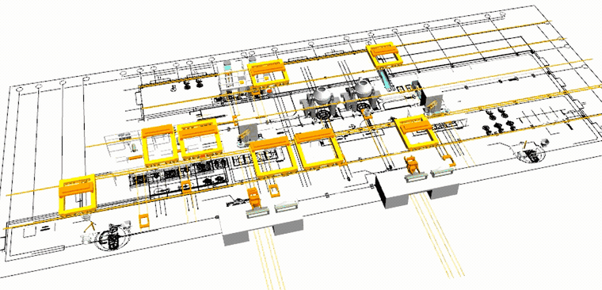</a>
      <a href="assets/casting-rhythm/model10.png">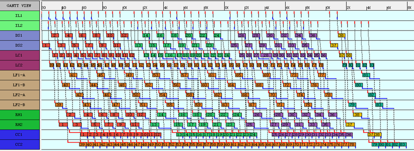</a>
    </td>
    <td width="50%" valign="top">
      <h3>Model 11 - Shandong Steel</h3>
      <p><b>185 heats</b> · BOF to continuous casting</p>
      <a href="assets/simulation/model11.gif">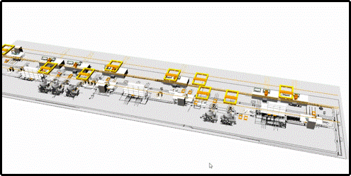</a>
      <a href="assets/casting-rhythm/model11.png">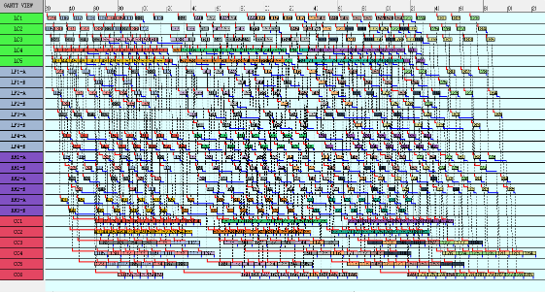</a>
    </td>
  </tr>
</table>

## What varies across the demonstrations

- **Production boundary:** the modeled process begins at hot-metal arrival or BOF production and extends to BOF or continuous casting, depending on the case.
- **Plant structure:** the models contain different machine combinations, parallel units, routing alternatives, and casting-machine arrangements.
- **Workload:** the demonstrated cases range from 41 to 257 heats, including an extended 72-hour scenario.
- **Calibration actions:** the cases include sequence-based and compact planning, route adaptation, casting-priority adjustment, delayed casting-start adjustment, and local schedule repair.

These variations illustrate why DT-SOPS is organized into reusable Scheduler, simulation-based DT, Evaluation, and Calibration components while retaining plant-specific model configuration.

## Reading the figures

The upper image in each card shows the corresponding simulation-based DT implementation. The lower image shows the planned production rhythm used to inspect casting continuity and temporal coordination. The demonstrations visualize plant-specific implementation; quantitative performance comparisons and statistical analyses are reported in the companion manuscript and its supplementary material.

## Companion manuscript

**DT-SOPS: A digital twin-enabled scheduling optimization system to bridge the model-reality gap with case studies in the steelmaking industry**

The manuscript positions the current implementation as an offline simulation-based DT. Connection to shop-floor sensors, controllers, and an online physical system remains future work.

## Repository contents

```text
.
|-- README.md
|-- assets/
|   |-- dt-sops-demonstration.mp4 # Full demonstration video
|   |-- dt-sops-video-preview.jpg # Video preview
|   |-- simulation/          # Plant-specific simulation views
|   `-- casting-rhythm/      # Production and continuous-casting rhythm charts
`-- data/
    `-- plant_catalog.csv    # Structured summary of the 12 demonstrations
```

## Data and confidentiality

This public repository contains demonstration images and an abstracted configuration catalog. It does not include proprietary raw production records, executable plant models, control interfaces, or confidential process parameters. Product-family identifiers shown in the source demonstrations are anonymized.
